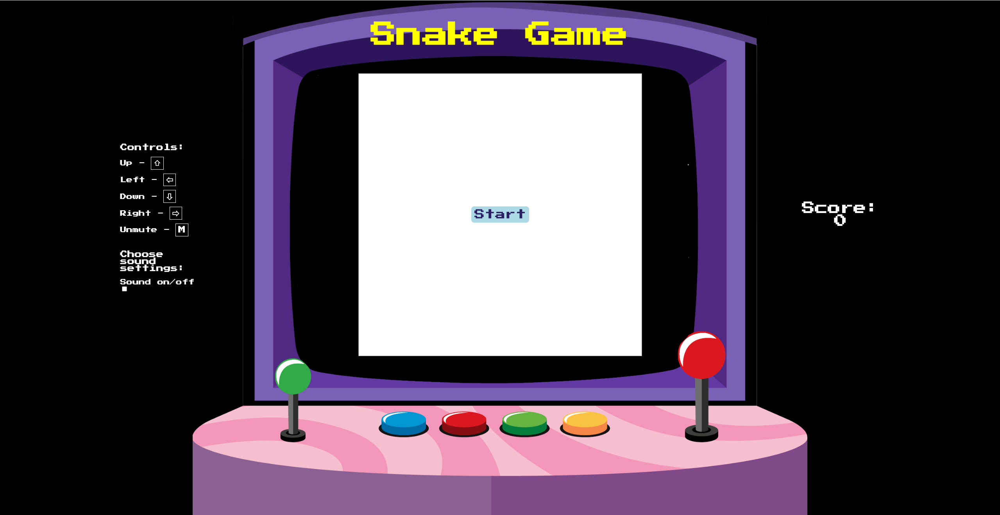

# Snake Game

Welcome to the Snake Game! This classic arcade game is implemented using Vanilla JavaScript and HTML5 Canvas, providing a nostalgic gaming experience right in your browser.🐍🎮

**Live Demo:** [https://nurasad.github.io/snake-game/](https://nurasad.github.io/snake-game/)

<picture>
 
</picture>

## Features

* Classic snake gameplay with intuitive controls.
* Responsive HTML5 Canvas rendering for smooth visuals.
* Score tracking to challenge your high score.
* Background music and sound effects which can be muted/unmuted by pressing M or using a checkbox.
* Game over detection with replay option for continuous fun.

## Purpose

I created this project during my learning of HTML5 Canvas. Initially, it consisted solely of a canvas element on a white background, with a snake moving inside a rectangular box. As development progressed, I decided to enhance its visual appeal by adding a background image to simulate an old arcade gaming station. Additionally, being a passionate gamer myself, I incorporated ambient soundtracks and sound effects to infuse the game with more fun and excitement.

## Lessons Learned
  During the course of working on this project, I acquired a deeper understanding of HTML Canvas functionality. Exploring the principles behind snake game programming and mechanics proved to be particularly intriguing, providing me with valuable insights into game development.

Moreover, it was my first encounter with utilizing an image as a background for an entire page, which necessitated learning how to configure it for responsiveness. This aspect added a layer of complexity to the project, but it also expanded my skills in web design and layout optimization.

During development, I encountered a couple of challenges along the way. One notable issue arose from the disparity in display characteristics, particularly with Apple products featuring Retina displays. The higher pixel density led to blurry rendering of elements drawn on the Canvas. To address this, I implemented a solution that involved adjusting the Canvas dimensions based on the display ratio, resulting in crisper visuals.

Another hurdle I faced pertained to the restrictions imposed by the Chrome Browser regarding background sounds. By default, Chrome prevents background sounds from playing automatically unless the user interacts with the page or until another sound is triggered. To bypass this limitation, I devised a workaround by incorporating a brief silence sound at the onset, effectively prompting the browser to unblock subsequent sound playback.

Overall, these challenges presented valuable learning opportunities, reinforcing my problem-solving skills and deepening my understanding of web development intricacies.
